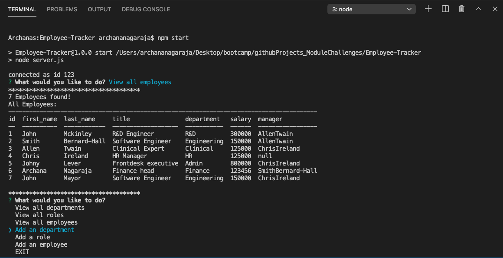

# Employee-Tracker

## Description

A nodejs application to manage a company's employee database, using Node.js, Inquirer, and MySQL with a User Story
AS A business owner
I WANT to be able to view and manage the departments, roles, and employees in my company
SO THAT I can organize and plan my business

## Table of Contents

* [Description](#description)
* [Demonstration](#demonstration)
* [Technologies](#technologies)
* [Installation](#installation)
* [License](#license)
* [Questions](#questions)

## Demonstration

### Terminal 
* 

### Demo video
* [Learn more by checking out the demo video here](https://drive.google.com/file/d/1wcliV0dJK27UdvCv469SJeMIvAP_icCR/view)

## Technologies

* [Node.js](https://nodejs.org/)
* [inquirer](https://www.npmjs.com/package/inquirer)
* [mysql2](https://www.npmjs.com/package/mysql2)
* [console.table](https://www.npmjs.com/package/console.table)

## Installation
* Git clone the repo git@github.com:archana-nagaraj/Employee-Tracker.git

* Install the following packages by running the following in terminal
    - npm init --y
    - npm install --save mysql2
    - npm install inquirer
    - npm install console.table --save  

* Sql commands
    - mysql -u root -p
    - source schema.sql
    - source seeds.sql

* Run the app
    node server.js 

## License

This repository is licensed under the [MIT license](./LICENSE).

## Questions

For any questions about the project/repository please contact me @ [archana.nagaraj@gmail.com](mailto:archana.nagaraj@gmail.com)  
GitHub @ [archana-nagaraj](https://github.com/archana-nagaraj) 
